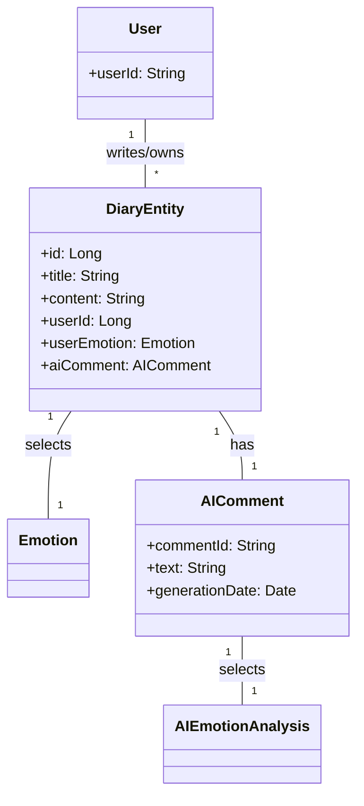
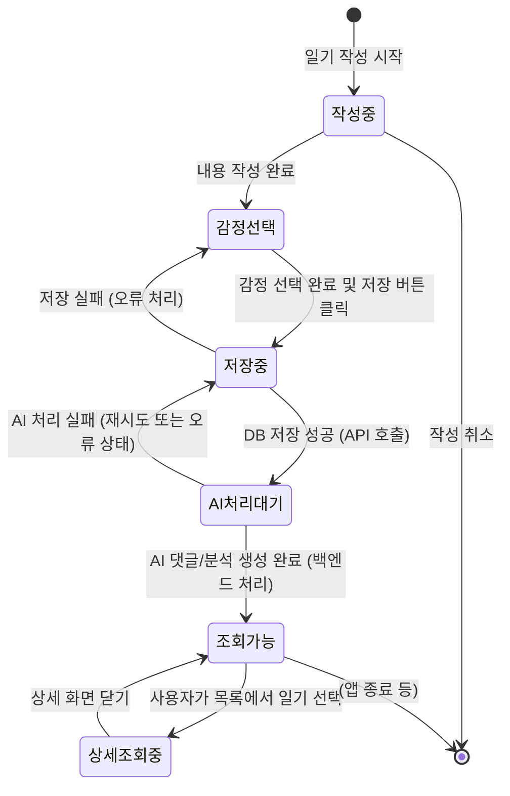

### 🟢 class diargram

```mermaid
classDiagram
    class User {
        +userId: String
    }

    class DiaryEntity {
        +id: Long
        +title: String
        +content: String
        +userId: Long
        +userEmotion: Emotion

        +aiComment: AIComment
    }

    class Emotion {
    }

    class AIComment {
        +commentId: String
        +text: String
        +generationDate: Date
    }

    User "1" -- "*" DiaryEntity : writes/owns
    DiaryEntity "1" -- "1" Emotion : selects
    DiaryEntity "1" -- "1" AIComment : has
    AIComment "1" -- "1" AIEmotionAnalysis : selects


```

### 🟢 state diargram

```mermaid
stateDiagram-v2
    [*] --> 작성중 : 일기 작성 시작

    작성중 --> 감정선택 : 내용 작성 완료
    작성중 --> [*] : 작성 취소

    감정선택 --> 저장중 : 감정 선택 완료 및 저장 버튼 클릭

    저장중 --> AI처리대기 : DB 저장 성공 (API 호출)
    저장중 --> 감정선택 : 저장 실패 (오류 처리)

    AI처리대기 --> 조회가능 : AI 댓글/분석 생성 완료 (백엔드 처리)
    AI처리대기 --> 저장중 : AI 처리 실패 (재시도 또는 오류 상태)

    조회가능 --> 상세조회중 : 사용자가 목록에서 일기 선택
    상세조회중 --> 조회가능 : 상세 화면 닫기

    조회가능 --> [*] : (앱 종료 등)

    %% AI처리는 댓글 생성과 감정 분석을 포함
```