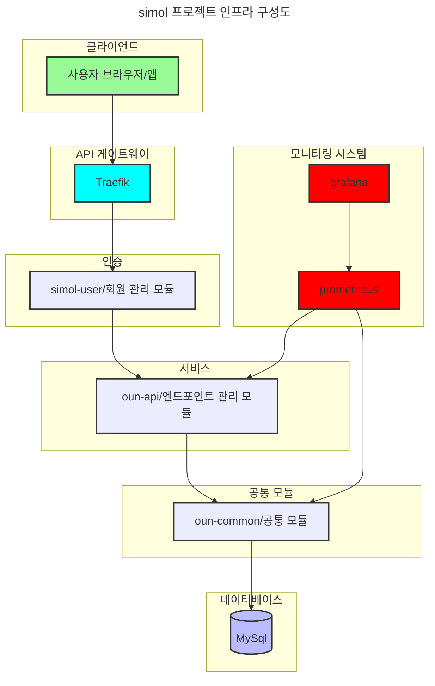
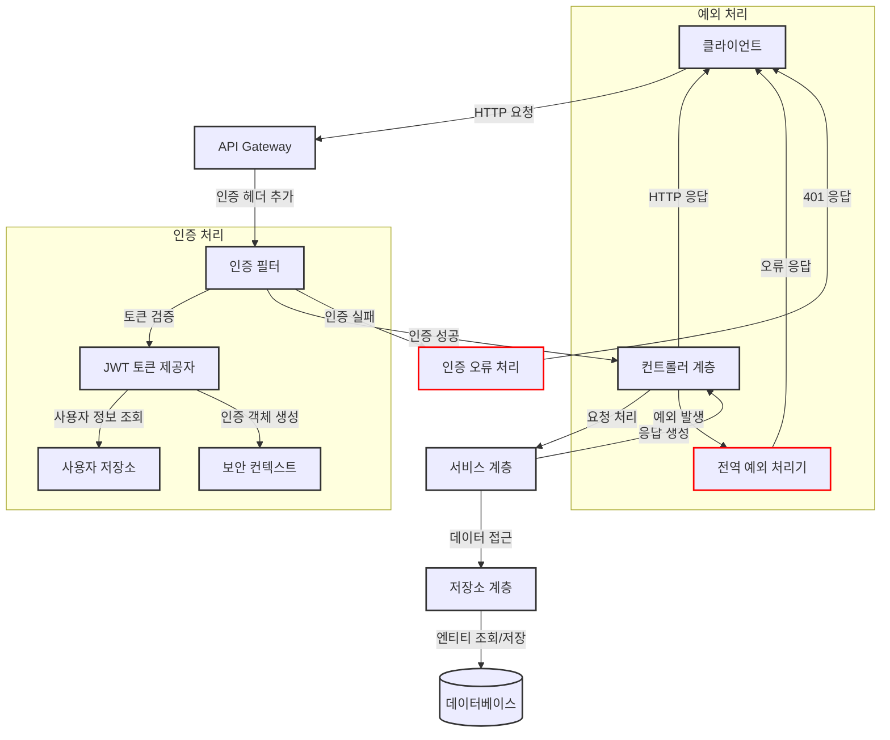
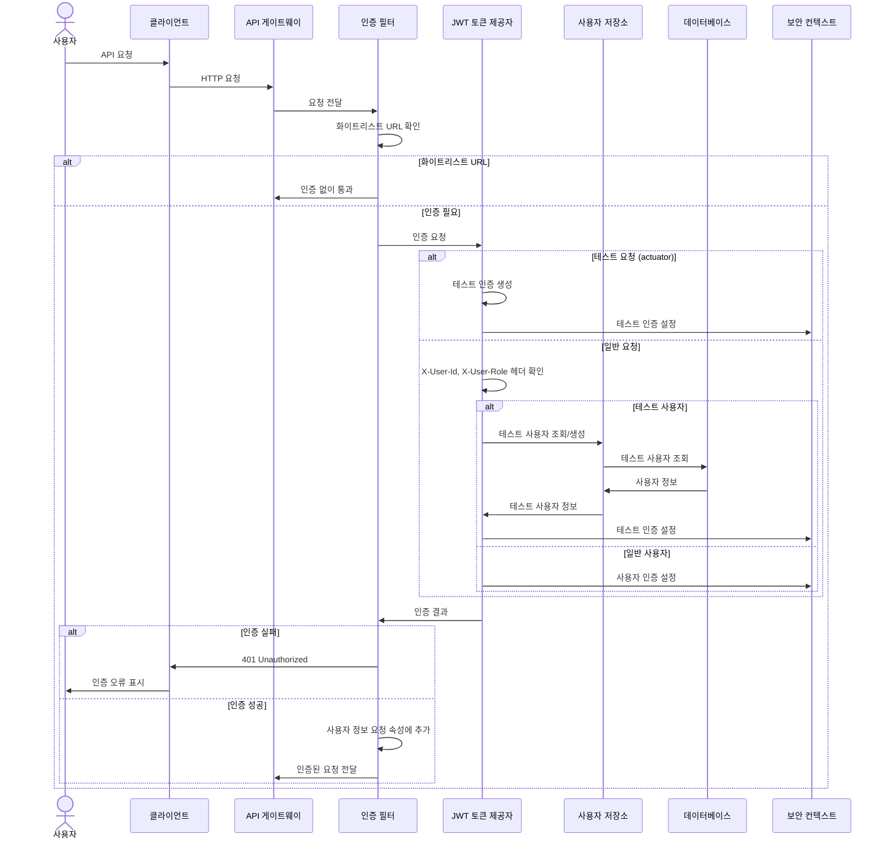
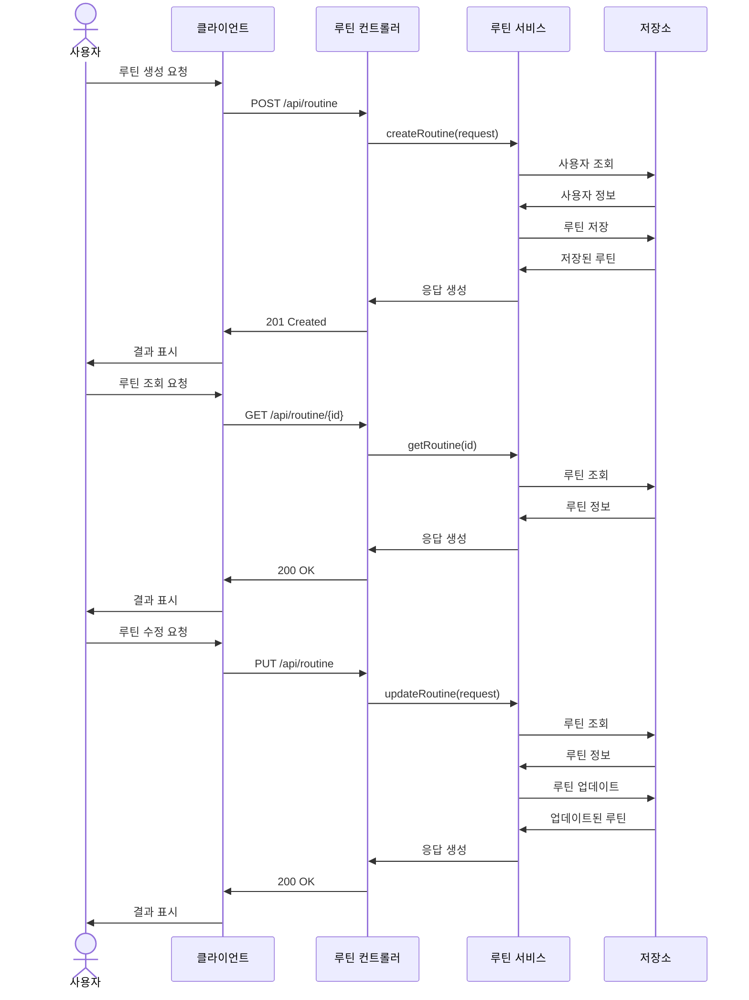
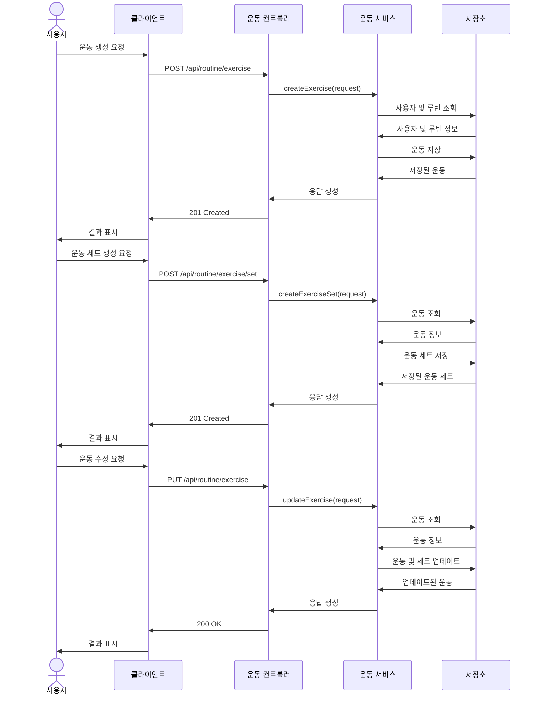
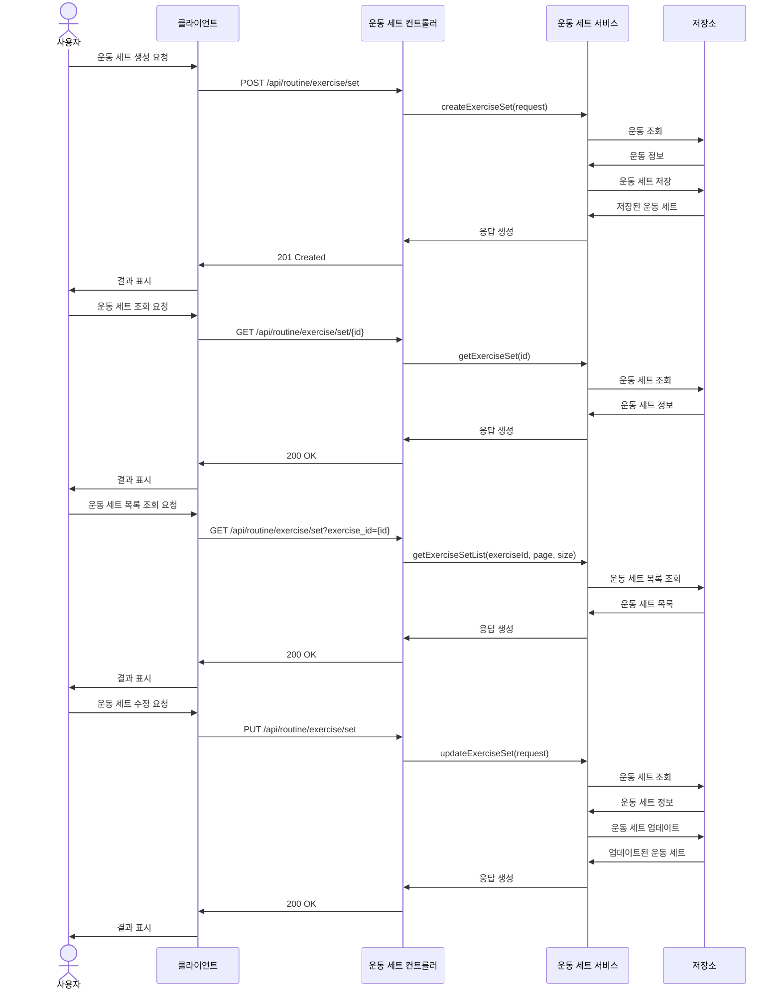
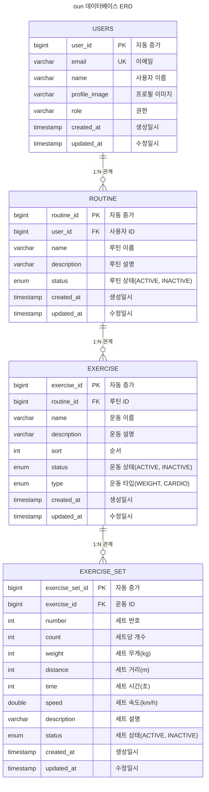

# 🔴 project preview

[프로젝트 미리보기](https://simol-oun.vercel.app/)

# 📗 Reference

[참고자료](./global/reference/README.md)

# 👨‍💻 Proejct 실행

순서대로 실행하시길 권장드립니다.

[mysql 실행방법](./mysql/README.md)

[redis 실행방법](./redis/README.md)

[traefik 실행방법](./traefik/README.md)

[simol-user 실행방법](./simol-user/README.md)

[oun-api 실행방법](./oun-api/README.md)

[monitoring](./monitoring/README.md)

# 🔴 front project

[oun-front github](https://github.com/juno-choi/oun-front)

# 🔴 project 구성

`oun-common` 프로젝트 전체적으로 사용되는 entity, dto, vo, repository 등 공동 사용 모듈

`simol-user` 회원 가입, 로그인 정보를 관리하는 모듈

`oun-api` endpoint를 관리하는 모듈

## 🟠 infra 구성

### 🟢 구성도

### 🟢 flow chart

## 🟠 시스템 구성

### 🟢 인증

### 🟢 루틴 생성

### 🟢 운동 프로세스

### 🟢 운동 세트

## 🟠 db 구성

### 🟢 ERD

## 🟠 skill set

`spring boot` `docker` `docker compose` `redis` `mysql` `swagger` `traefik` `java21` `gradle` `jpa` `querydsl`