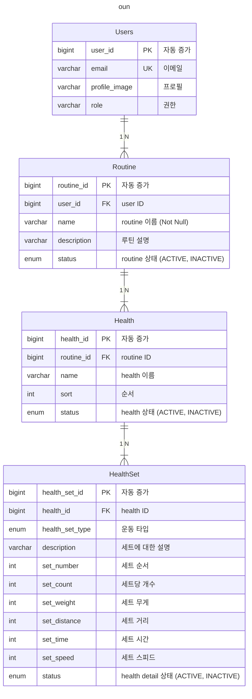

# 🔴 project 실행

## 🟠 project 환경변수 설정

프로젝트 폴더 내 `.env` 파일을 생성하여 아래 환경 변수를 설정해주세요.

기본 port 값 변경시 docker-compose.yml 파일에서 수정해서 사용해주세요~!

### 🟢 oun-user 환경 변수 설정

`기본 port` 8080

```
CONTAINER_NAME=oun-auth
SERVER_PROFILE=dev
GOOGLE_CLIENT_ID=your_google_client_id
GOOGLE_CLIENT_SECRET=your_google_client_secret
JWT_SECRET_KEY=your_jwt_secret_key
MYSQL_USER=your_db_user
MYSQL_PASSWORD=your_db_user_password
MYSQL_ROOT_PASSWORD=your_db_root_password
```

### 🟢 oun-api 환경 변수 설정

`기본 port` 8081

```
CONTAINER_NAME=oun-api
SERVER_PROFILE=dev
JWT_SECRET_KEY=your_jwt_secret_key
MYSQL_USER=your_db_user
MYSQL_PASSWORD=your_db_user_password
MYSQL_ROOT_PASSWORD=your_db_root_password
```

### 🟢 mysql 환경 변수 설정

```
MYSQL_USER=your_db_user
MYSQL_PASSWORD=your_db_user_password
MYSQL_ROOT_PASSWORD=your_db_root_password
```

### 🟢 traefik 환경 변수 설정

```
CONTAINER_NAME=oun-auth
SERVER_PROFILE=dev
GOOGLE_CLIENT_ID=your_google_client_id
GOOGLE_CLIENT_SECRET=your_google_client_secret
JWT_SECRET_KEY=your_jwt_secret_key
MYSQL_USER=your_db_user
MYSQL_PASSWORD=your_db_user_password
MYSQL_ROOT_PASSWORD=your_db_root_password
```

## 🟠 project 실행

### 🟢 각 프로젝트 별로 실행

모든 실행 전

```bash
./gradlew clean build
```
실행 후 진행해주세요~!

1. redis
2. mysql
3. oun-user
4. oun-api

순서로 실행해주시면 됩니다.


```
docker-compose -f ./redis/docker-compose.yml up -d --build
docker-compose -f ./mysql/docker-compose.yml up -d --build
docker-compose -f ./oun-user/docker-compose.yml up -d --build
docker-compose -f ./oun-api/docker-compose.yml up -d --build
```

### 🟢 traefik 실행

1. redis
2. mysql
3. traefik

순서로 실행해주시면 됩니다.


```
docker-compose -f ./redis/docker-compose.yml up -d --build
docker-compose -f ./mysql/docker-compose.yml up -d --build
docker-compose -f ./traefik/docker-compose.yml up -d --build
```

---

# 🔴 project 구성

## 🟠 oun ERD



# 📗 Reference

[참고자료](./global/reference/README.md)