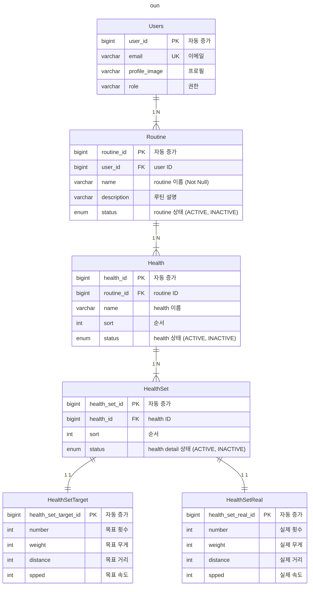

# 🔴 project 실행

## 🟠 Reference

[참고자료](./global/reference/README.md)

## 🟠 redis 실행

colima or docker desktop 설치 후
```bash
colima start
```

```bash
docker-compose -f redis/docker-compose.yml up -d
```

## 🟠 oun ERD

