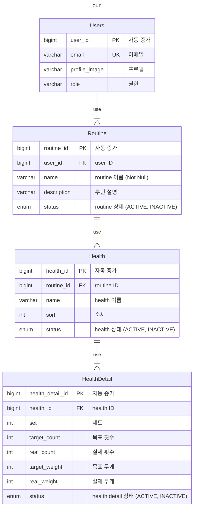

# 🔴 project 실행

## 1. redis 실행

colima or docker desktop 설치 후
```bash
colima start
```

```bash
docker-compose -f redis/docker-compose.yml up -d
```

## 🟠 oun ERD


```mermaid
---
title: oun
---

erDiagram

    Users {
        bigint user_id PK "자동 증가"
        varchar email UK "이메일"
        varchar profile_image "프로필"
        varchar role "권한"
    }
    
    Routine {
        bigint routine_id PK "자동 증가"
        bigint user_id FK "user ID"
        varchar name "routine 이름 (Not Null)"
        varchar description "루틴 설명"
        enum status "routine 상태 (ACTIVE, INACTIVE)"
    }
    
    Health {
        bigint health_id PK "자동 증가"
        bigint routine_id FK "routine ID"
        varchar name "health 이름"
        int sort "순서"
        enum status "health 상태 (ACTIVE, INACTIVE)"
    }

    HealthDetail {
        bigint health_detail_id PK "자동 증가"
        bigint health_id FK "health ID"
        int set "세트"
        int target_count "목표 횟수"
        int real_count "실제 횟수"
        int target_weight "목표 무게"
        int real_weight "실제 무게"
        enum status "health detail 상태 (ACTIVE, INACTIVE)"
    }

    Users ||--|{ Routine : "use"
    Routine ||--|{ Health : "use"
    Health ||--|{ HealthDetail : "use"
```