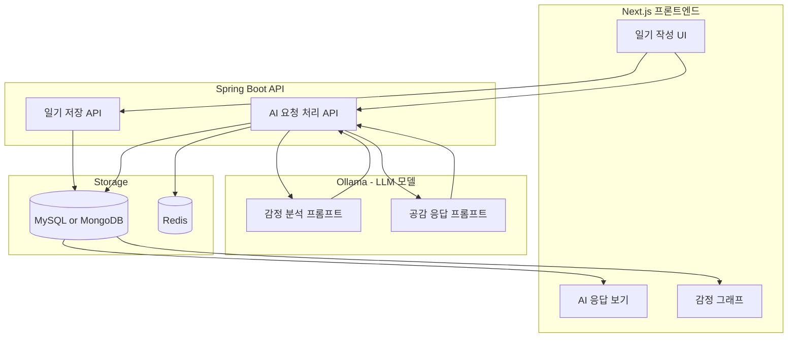
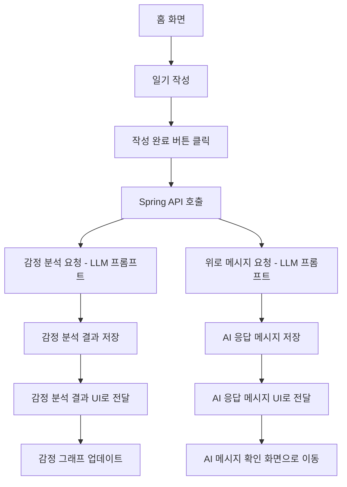
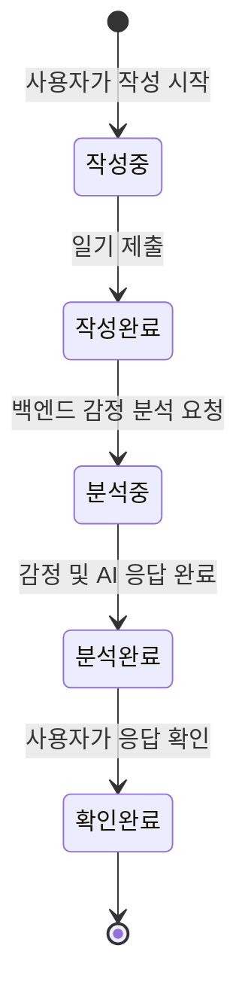
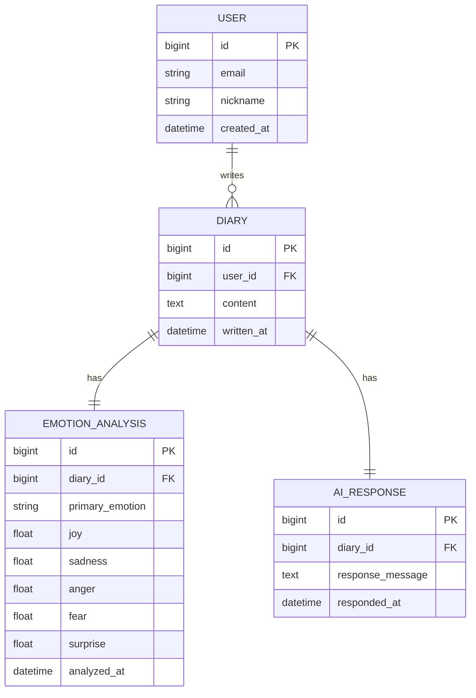

# 🔴 Sium

## 🟠 시스템 구성

PO & TPO GPT를 생성하여 mermaid 문법으로 문서를 작성하였습니다.

### 🟢 System Architecture

```mermaid
graph TD
    subgraph Frontend [Next.js 프론트엔드]
        F1[일기 작성 UI]
        F2[AI 응답 보기]
        F3[감정 그래프]
    end

    subgraph Backend [Spring Boot API]
        B1[일기 저장 API]
        B2[AI 요청 처리 API]
    end

    subgraph AI_Server [Ollama - LLM 모델]
        A1[감정 분석 프롬프트]
        A2[공감 응답 프롬프트]
    end

    subgraph Storage
        DB[(MySQL or MongoDB)]
        Cache[(Redis)]
    end

    F1 --> B1
    F1 --> B2
    B2 --> A1
    B2 --> A2
    A1 --> B2
    A2 --> B2
    B1 --> DB
    B2 --> DB
    B2 --> Cache
    DB --> F3
    DB --> F2
```

### 🟢 User Flow

```mermaid
flowchart TD
    A[홈 화면] --> B[일기 작성]
    B --> C[작성 완료 버튼 클릭]
    C --> D[Spring API 호출]
    D --> E[감정 분석 요청 - LLM 프롬프트]
    D --> F[위로 메시지 요청 - LLM 프롬프트]
    E --> G[감정 분석 결과 저장]
    F --> H[AI 응답 메시지 저장]
    G --> I[감정 분석 결과 UI로 전달]
    H --> J[AI 응답 메시지 UI로 전달]
    I --> K[감정 그래프 업데이트]
    J --> L[AI 메시지 확인 화면으로 이동]
```

### 🟢 Status Diagram

```mermaid
stateDiagram-v2
    [*] --> 작성중 : 사용자가 작성 시작
    작성중 --> 작성완료 : 일기 제출
    작성완료 --> 분석중 : 백엔드 감정 분석 요청
    분석중 --> 분석완료 : 감정 및 AI 응답 완료
    분석완료 --> 확인완료 : 사용자가 응답 확인
    확인완료 --> [*]
```

### 🟢 ERD

```mermaid
erDiagram
    USER ||--o{ DIARY : writes
    DIARY ||--|| EMOTION_ANALYSIS : has
    DIARY ||--|| AI_RESPONSE : has

    USER {
        bigint id PK
        string email
        string nickname
        datetime created_at
    }

    DIARY {
        bigint id PK
        bigint user_id FK
        text content
        datetime written_at
    }

    EMOTION_ANALYSIS {
        bigint id PK
        bigint diary_id FK
        string primary_emotion
        float joy
        float sadness
        float anger
        float fear
        float surprise
        datetime analyzed_at
    }

    AI_RESPONSE {
        bigint id PK
        bigint diary_id FK
        text response_message
        datetime responded_at
    }
```
